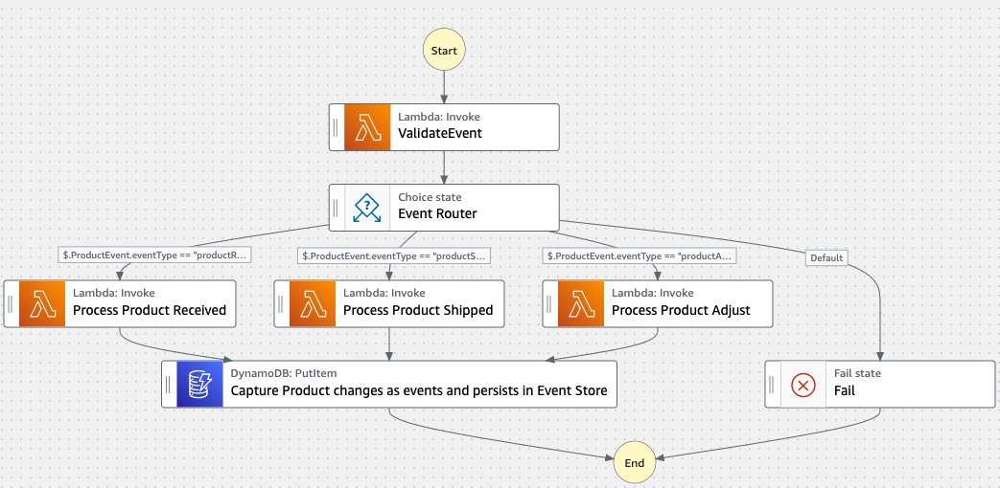

# Event Sourcing Pattern

This application creates a mock product inventory workflow. It demonstrates the power of Step Functions to orchestrate Lambda functions using the Event Sourcing behavioral design pattern consisting of a state machine that contains a series of tasks (AWS Lambda Functions), simulating few events in Product Inventory workflow . Each task contains mock logic that process a particular product event and then passes on the updated product state to the next processing task. The updated product state changes along with input event is finally stored in the Product Inventory Event log.

This project contains source code and supporting files for a serverless application that you can deploy with the SAM CLI. It includes the following files and folders:

- functions - Code for the application's Lambda functions to process different product inventory events (samples : Product Created, Shipped, Adjusted)
- statemachines - Definition for the state machine that orchestrates product inventory workflow.
- template.yaml - A template that defines the application's AWS resources.

The application uses several AWS resources, including Step Functions state machines, Lambda functions and DynamoDB. These resources are defined in the `template.yaml` file in this project. You can update the template to add AWS resources through the same deployment process that updates your application code.

## Requirements

* [Create an AWS account](https://portal.aws.amazon.com/gp/aws/developer/registration/index.html) if you do not already have one and log in. The IAM user that you use must have sufficient permissions to make necessary AWS service calls and manage AWS resources.
* [AWS CLI](https://docs.aws.amazon.com/cli/latest/userguide/install-cliv2.html) installed and configured
* [Git Installed](https://git-scm.com/book/en/v2/Getting-Started-Installing-Git)
* [AWS Serverless Application Model](https://docs.aws.amazon.com/serverless-application-model/latest/developerguide/serverless-sam-cli-install.html) (AWS SAM) installed

## Deployment Instructions

1. Create a new directory, navigate to that directory in a terminal and clone the GitHub repository:
    ```
    git clone https://github.com/aws-samples/step-functions-workflows-collection
    ```
1. Change directory to the pattern directory:
    ```
    cd event-sourcing
    ```
1. From the command line, use AWS SAM to deploy the AWS resources for the workflow as specified in the template.yaml file:
    ```
    sam deploy --guided
    ```
1. During the prompts:
    * Enter a stack name
    * Enter the desired AWS Region
    * Allow SAM CLI to create IAM roles with the required permissions.

    Once you have run `sam deploy --guided` mode once and saved arguments to a configuration file (samconfig.toml), you can use `sam deploy` in future to use these defaults.

1. Note the outputs from the SAM deployment process. These contain the resource names and/or ARNs which are used for testing.


The deploy command will package and deploy your application to AWS, with a series of prompts:

* **Stack Name**: The name of the stack to deploy to CloudFormation. This should be unique to your account and region, and a good starting point would be something matching your project name.
* **AWS Region**: The AWS region you want to deploy your app to.
* **Confirm changes before deploy**: If set to yes, any change sets will be shown to you before execution for manual review. If set to no, the AWS SAM CLI will automatically deploy application changes.
* **Allow SAM CLI IAM role creation**: Many AWS SAM templates, including this example, create AWS IAM roles required for the AWS Lambda function(s) included to access AWS services. By default, these are scoped down to minimum required permissions. To deploy an AWS CloudFormation stack which creates or modifies IAM roles, the `CAPABILITY_IAM` value for `capabilities` must be provided. If permission isn't provided through this prompt, to deploy this example you must explicitly pass `--capabilities CAPABILITY_IAM` to the `sam deploy` command.
* **Save arguments to samconfig.toml**: If set to yes, your choices will be saved to a configuration file inside the project, so that in the future you can just re-run `sam deploy` without parameters to deploy changes to your application.

## Use the SAM CLI to build locally

Build the Lambda functions in your application with the `sam build` command.

```
event-sourcing$ sam build
```

The SAM CLI installs dependencies defined in `functions/*/requirements.txt`, creates a deployment package, and saves it in the `.aws-sam/build` folder.

## Fetch, tail, and filter Lambda function logs

To simplify troubleshooting, SAM CLI has a command called `sam logs`. `sam logs` lets you fetch logs generated by your deployed Lambda function from the command line. In addition to printing the logs on the terminal, this command has several nifty features to help you quickly find the bug.

`NOTE`: This command works for all AWS Lambda functions; not just the ones you deploy using SAM.

```
event-sourcing$ sam logs -n Dispense50Function --stack-name event-sourcing --tail
```

## How it works

The state machine takes a json input with a key-value pair for the amount of money the ATM should dispense. Then the workflow goes through the chain of tasks that dispense $50, $20, $10 & $1 bills. Each task would dispense its notes, change the value of the "dispense" property and add the amount of notes it dispensed. The output of that task will be passed as an input of the next one. At the end, if the input "dispense" property was an integer, all the money should be dispensed and the "dispense" property should be equal to "0"

Sample input:
```
{
    "dispense": "185"
}
```

Sample output:
```
{
  "dispense": "0",
  "50s": "3",
  "20s": "1",
  "10s": "1",
  "1s": "5"
}
```


## Image



## Cleanup

To delete the sample application that you created, use the AWS CLI by running the following commands:

1. Delete the stack
    ```bash
    aws cloudformation delete-stack --stack-name STACK_NAME
    ```
1. Confirm the stack has been deleted
    ```bash
    aws cloudformation list-stacks --query "StackSummaries[?contains(StackName,'STACK_NAME')].StackStatus"
    ```
----
Copyright 2022 Amazon.com, Inc. or its affiliates. All Rights Reserved.
